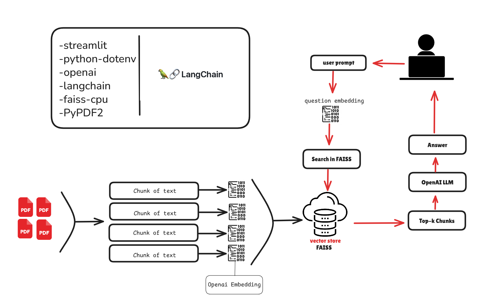

## 🧠 Architecture




# 📚 PDF Chatbot

An interactive PDF-based chatbot built with **Streamlit**, **LangChain**, and **OpenAI**.  
Users can upload one or more PDF files and ask natural language questions. The bot will answer based on the contents of the uploaded PDFs.

---

## 🎥 YouTube Tutorial Series

Watch the step-by-step YouTube playlist to learn how this project was built:

[](https://www.youtube.com/watch?v=OHxIF8F81Mw&list=PL79K02UCsAZA_t0rZPOf1qKF67koj0Ir9)

📺 [Open the Full Playlist on YouTube](https://www.youtube.com/watch?v=OHxIF8F81Mw&list=PL79K02UCsAZA_t0rZPOf1qKF67koj0Ir9&ab_channel=AdemG%C3%BCney)

---

## 🚀 Features

- 📄 Upload multiple PDF files
- 🧠 Text is automatically extracted and chunked
- 🔍 Semantic search using FAISS vector store
- 🤖 Question answering powered by OpenAI
- 💬 Chat history with previous questions and answers
- 📚 Displays source document excerpts

---

## 🛠️ Tech Stack

- [Streamlit](https://streamlit.io/)
- [LangChain](https://www.langchain.com/)
- [OpenAI](https://platform.openai.com/)
- [FAISS](https://github.com/facebookresearch/faiss)
- [PyPDF2](https://pypi.org/project/PyPDF2/)
- [tiktoken](https://pypi.org/project/tiktoken/)

---

## 📦 Installation

```bash
git clone https://github.com/ademguney/ai-chat-pdf.git
cd ai-chat-pdf
python -m venv .venv
source .venv/bin/activate  # or `.venv\Scripts\activate` on Windows
pip install -r requirements.txt
```
